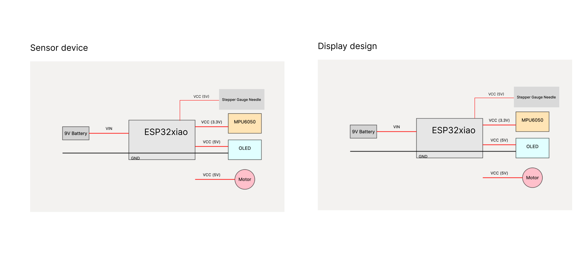

# The Smart Stabilizer Ball

The Smart Stabilizer Ball is a fitness device with a Gyroscope and acceleration sensor to measure your balance and body position in real-time. When the user tilts too far in any direction, it provides instant feedback through its screen display and gentle vibrations, helping people improve their core strength.

# Sensor Design
The MPU6050, using a Gyroscope sensor, continuously measures acceleration along all axes. 
Balance Monitoring 
On/off button for turning on the balance mode
Tilt angles are calculated using accelerometer data 

X-axis: Measures forward/backward tilt  
Y-axis: Measures side-to-side tilt 

The system calculates angles relative to a vertical position 

# display Design
- The stepper gauge needle indicates real-time measurements like tilt - A clear warning message appears on the screen during excessive tilt: “ Tilt”  
- OLED display shows real-time tilt angles 
if the person is balancing, show “ good position” on the OLED screen
- Vibration motor activates when tilt exceeds 30 degrees 

